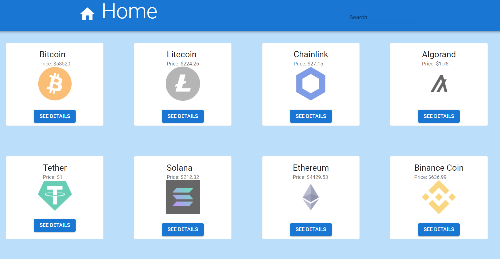

# Cryptos Statistics

 

> Web application to show data and prices for top Crypto Currencies.

# Live Demo
you can check out website [here](https://elastic-mestorf-f7a890.netlify.app/)

## Preview

## Built With

- React
- Redux
- API
- Material Ui

## Getting Started
Before we start, make sure you fit the prerequisites, the source code is inside the folder SRC/

### Prerequisites
- npm installed
- VSCode
- React-based on components

### Setup
- git clone https://github.com/iammouaz/cryptos-statistics.git

### Install
- `npm install`
- `npm install --also=dev` (to install the dev dependencies, like webpack)

### Usage
- `npm start` from VSCode

### Run tests
- `npm tests`

### Deployment
- `npm deploy`

## Authors

👤 **Moaz El Molkey**

- GitHub: [@iammouaz](https://github.com/iammouaz)
- Twitter: [@MoazMulki1](https://twitter.com/MoazMulki1)
- LinkedIn: [Mouaz El Molkey](https://www.linkedin.com/in/mohammad-mouaz-molki-1368981bb/)

## 🤝 Contributing

Contributions, issues, and feature requests are welcome!

Feel free to check the [issues page](../../issues/).

## Show your support

Give a ⭐️ if you like this project!

## Acknowledgments

To everyone in Microverse.

## Credits

- [CoinGecko](https://www.coingecko.com/en/api/documentation) API
- [Nelson Sakwa](https://www.behance.net/sakwadesignstudio) for the [design](https://www.behance.net/gallery/31579789/Ballhead-App-(Free-PSDs)) inspiration

## 📝 License

This project is [MIT](./LICENSE) licensed.
